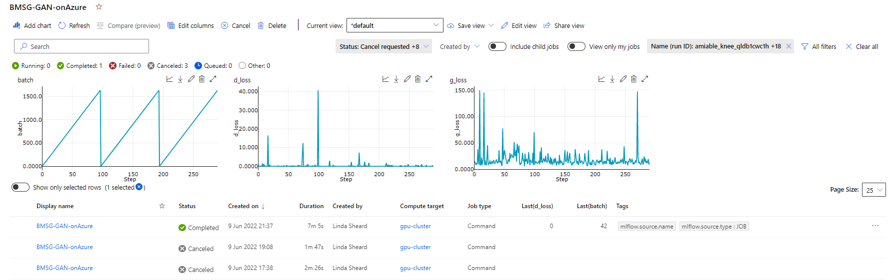

# Run BMSG-GAN on Azure Machine Learning

## Pre-requisites

1. An [Azure subscription](https://azure.microsoft.com/en-gb/)
2. An [Azure Machine Learning workspace](https://docs.microsoft.com/en-us/azure/machine-learning/concept-workspace#-create-a-workspace)
3. A development environment with this repo and the [Azure ML CLI v2](https://docs.microsoft.com/en-us/azure/machine-learning/how-to-configure-cli?tabs=public), connected to the above workspace
4. A dataset of images uploaded into Azure Blob storage

> *Note: The development environment does not need to be a powerful machine, as the ML job will be submitted to a remote compute target managed by Azure ML. You can also use an [Azure Machine Learning Compute Instance](https://docs.microsoft.com/en-us/azure/machine-learning/concept-compute-instance) as the development environment - in this case, the Azure ML CLI v2 will already be available.*

## 1. One-off actions

### 1a) Create a gpu compute target

> *Note: this does not incur compute cost until a job is submitted to it, and then only until the end of the configurable scale down time after the job completes. Consider using `tier: low_priority` during development.*

Review the configuration in `azure-cli/compute-target.yml`.
```
az ml compute create -f azure-cli/compute-target.yml 
```
Reference:
- https://docs.microsoft.com/en-us/azure/machine-learning/concept-compute-target 
- https://docs.microsoft.com/en-us/azure/machine-learning/reference-yaml-compute-aml

### 1b) Create a connection from the Azure ML Workspace to your datastore
Review the configuration in `azure-cli/datastore.yml` and update it to point to the blob storage container that contains your input dataset. Add the account key for authentication. The exact path to the dataset is configured later.
> *Note: to avoid placing the account key into the git repo, you can also [configure the datastore in the GUI portal](https://docs.microsoft.com/en-us/azure/machine-learning/how-to-connect-data-ui?tabs=credential#create-datastores), and use the code-based configuration only when using alternative methods such as identity-based access.*
```
az ml datastore create -f azure-cli/datastore.yml
```
Reference
- https://docs.microsoft.com/en-us/azure/machine-learning/concept-data?tabs=uri-file-example%2Ccli-data-create-example#datastore
- https://docs.microsoft.com/en-gb/azure/machine-learning/reference-yaml-datastore-blob


## 2. Run BMSG-GAN

Review the configuration in `azure-cli/job.yml`. Note this example makes use of an Azure Machine Learning curated environment that fits the requirements of BMSG-GAN.

```
az ml job create -f azure-cli/job.yml
```

> 💡 *Since BMSG-GAN code is currently not written to leverage PyTorch [DistributedDataParallel](https://pytorch.org/tutorials/beginner/dist_overview.html), each job runs on a single node of the compute target. If the compute target is a cluster of N nodes, N jobs can be submitted and run without queueing. To make use of the cluster size in a different way, see also [sweep jobs](https://docs.microsoft.com/en-us/azure/machine-learning/reference-yaml-job-sweep).*

References
- https://docs.microsoft.com/en-us/azure/machine-learning/reference-yaml-job-command

## 3. Optional: Add mlflow logging to your code
The code contains a couple of examples of how to send logs from your runs to the mlfow dashboard in AzureML.

Mlflow allows logging of parameters, metrics, and artifacts. 

For example, to chart the d_loss and g_loss in the AzureML dashboard, the following has been added to GAN.py:

```py
                    ## Optional: log run with mlflow (charted metrics)
                    if USE_MLFLOW_LOGGING:
                        mlflow.log_metric('batch',i)
                        mlflow.log_metric('d_loss', dis_loss)
                        mlflow.log_metric('g_loss',gen_loss)
                    ## end optional
```



To log parameters to the run, the following example has been added to train.py:

```py
   ## Optional: log to AzureML run with mlflow
    if USE_MLFLOW_LOGGING:
        mlflow.log_param('loss function', args.loss_function)
    ## end optional
```

To log artifacts, the discrimator and generator config has been logged and stored to the run as follows:
(Note that anything the code places in a local `logs` or `outputs` directory is automatically uploaded to the run, so this code is only needed because the artifact is not written to one of those locations)

```py
    ## Optional: log to AzureML run with mlflow
    if USE_MLFLOW_LOGGING:
        with open('generator_config.txt', 'w+') as f:
            f.write("Generator Configuration: ")
            f.write(str(msg_gan.gen))
        mlflow.log_artifact('generator_config.txt')
    ## end optional
```

### Further Reading
- [sweep jobs](https://docs.microsoft.com/en-us/azure/machine-learning/reference-yaml-job-sweep) and [multi-step pipelines](https://docs.microsoft.com/en-us/azure/machine-learning/reference-yaml-job-pipeline)
- [options for specifying environments](https://gist.github.com/lindacmsheard/27516b523ccde85590cbaa4df3ca54a1): curated Azure ML environments , open source docker images, images with additional custom conda depencies, or building from Dockerfile.

